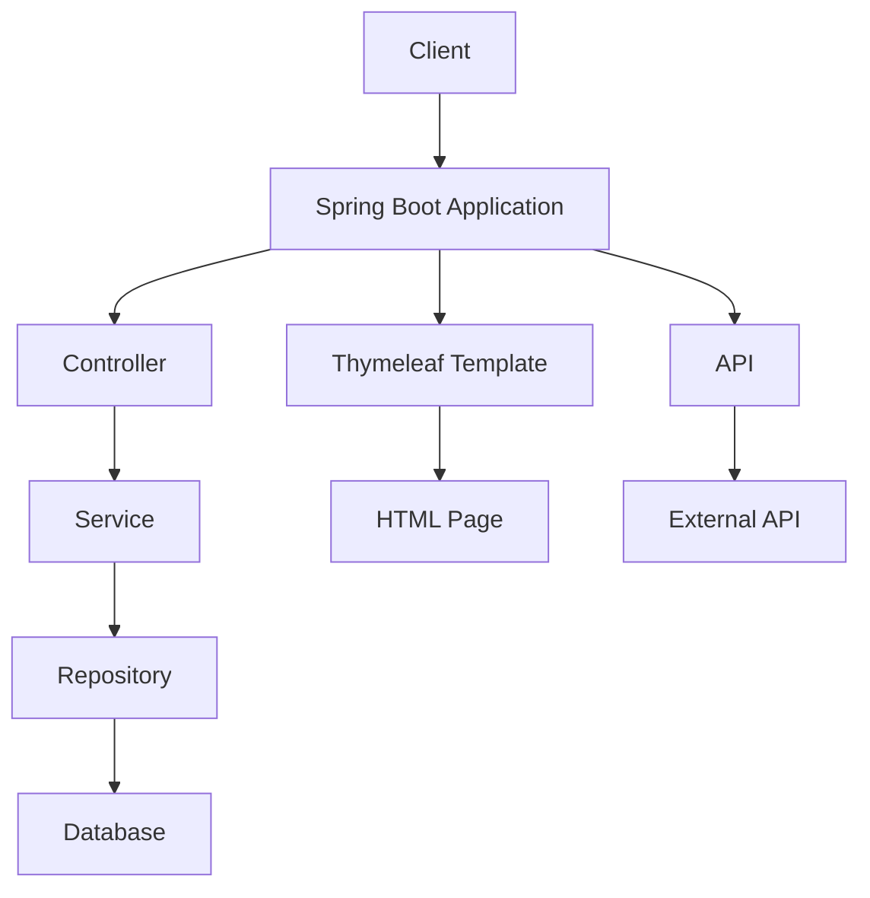

# Documentation Technique pour SpringBoot Training

## Table des Matières

1. [Vue d'ensemble du projet](#vue-densemble-du-projet)
2. [Architecture technique](#architecture-technique)
3. [Instructions de configuration](#instructions-de-configuration)
4. [Dépendances et prérequis](#dépendances-et-prérequis)
5. [Configuration](#configuration)
6. [Documentation de l'API](#documentation-de-lapi)
7. [Cas d'utilisation courants](#cas-dutilisation-courants)
8. [Guide de dépannage](#guide-de-dépannage)
9. [Considérations de sécurité](#considérations-de-sécurité)
10. [Optimisations de performance](#optimisations-de-performance)
11. [Lignes directrices pour les tests](#lignes-directrices-pour-les-tests)
12. [Processus de déploiement](#processus-de-déploiement)
13. [Procédures de maintenance](#procédures-de-maintenance)
14. [Informations de contact](#informations-de-contact)

---

## Vue d'ensemble du projet

Le projet **SpringBoot Training** est une application Spring Boot qui configure divers paramètres pour une application web. Ce projet inclut des configurations globales, des paramètres de serveur, des niveaux de journalisation, des URL d'API, et des configurations Thymeleaf. Il utilise également des fichiers de métadonnées pour les propriétés de configuration personnalisées et des templates Thymeleaf pour rendre les pages web.

---

## Architecture technique

### Diagramme de l'architecture



### Modèles de conception et décisions architecturales

- **Modèle MVC (Model-View-Controller)**: Utilisé pour séparer les préoccupations et faciliter la maintenance.
- **Spring Boot**: Choisie pour son auto-configuration et son intégration facile avec les composants Spring.
- **Thymeleaf**: Utilisé pour le rendu des templates HTML côté serveur.
- **H2 Database**: Utilisé pour un stockage de données en mémoire pour les tests et le développement.

### Exemple de code

```java
// ApiApplication.java
@SpringBootApplication
public class ApiApplication implements CommandLineRunner {

    @Autowired
    private CustomProperties customProperties;

    public static void main(String[] args) {
        SpringApplication.run(ApiApplication.class, args);
    }

    @Override
    public void run(String... args) throws Exception {
        System.out.println("Server started on port " + customProperties.getApiUrl());
    }
}
```

---

## Instructions de configuration

### Prérequis

- **Java 21**: Assurez-vous que Java 21 est installé.
- **Maven**: Utilisez le wrapper Maven pour une configuration cohérente.
- **IDE**: Utilisez un IDE comme IntelliJ IDEA, STS, ou VS Code.

### Configuration

1. **Cloner le dépôt**:
    ```bash
    git clone https://github.com/votre-repo/spring-boot-training.git
    cd spring-boot-training
    ```

2. **Exécuter l'application**:
    ```bash
    ./mvnw spring-boot:run
    ```

---

## Dépendances et prérequis

### Tableau des dépendances

| Dépendance                | Version   | Description                          |
|---------------------------|-----------|--------------------------------------|
| Spring Boot Starter Web   | 3.1.0     | Pour les fonctionnalités web        |
| Spring Data JPA           | 3.1.0     | Pour l'accès aux données JPA        |
| Thymeleaf                  | 3.1.0     | Pour le rendu des templates HTML    |
| H2 Database               | 2.1.214   | Pour le stockage de données en mémoire |
| Lombok                     | 1.18.24   | Pour la génération de code         |
| Spring Boot Test          | 3.1.0     | Pour les tests unitaires            |

### Exemple de fichier `pom.xml`

```xml
<project xmlns="http://maven.apache.org/POM/4.0.0"
         xmlns:xsi="http://www.w3.org/2001/XMLSchema-instance"
         xsi:schemaLocation="http://maven.apache.org/POM/4.0.0 http://maven.apache.org/xsd/maven-4.0.0.xsd">
    <modelVersion>4.0.0</modelVersion>
    <groupId>com.pcaboor</groupId>
    <artifactId>spring-boot-training</artifactId>
    <version>1.0.0</version>
    <parent>
        <groupId>org.springframework.boot</groupId>
        <artifactId>spring-boot-starter-parent</artifactId>
        <version>3.1.0</version>
    </parent>
    <dependencies>
        <dependency>
            <groupId>org.springframework.boot</groupId>
            <artifactId>spring-boot-starter-web</artifactId>
        </dependency>
        <dependency>
            <groupId>org.springframework.boot</groupId>
            <artifactId>spring-boot-starter-data-jpa</artifactId>
        </dependency>
        <dependency>
            <groupId>org.springframework.boot</groupId>
            <artifactId>spring-boot-starter-thymeleaf</artifactId>
        </dependency>
        <dependency>
            <groupId>com.h2database</groupId>
            <artifactId>h2</artifactId>
            <scope>runtime</scope>
        </dependency>
        <dependency>
            <groupId>org.projectlombok</groupId>
            <artifactId>lombok</artifactId>
            <optional>true</optional>
        </dependency>
        <dependency>
            <groupId>org.springframework.boot</groupId>
            <artifactId>spring-boot-starter-test</artifactId>
            <scope>test</scope>
        </dependency>
    </dependencies>
    <build>
        <plugins>
            <plugin>
                <groupId>org.springframework.boot</groupId>
                <artifactId>spring-boot-maven-plugin</artifactId>
            </plugin>
        </plugins>
    </build>
</project>
```

---

## Configuration

### Fichier `application.properties`

```properties
# Global Configuration
spring.application.name=webapp

# Tomcat Configuration
server.port=9001

# Logging Configuration
logging.level.root=ERROR
logging.level.com.pcaboor=INFO
logging.level.org.springframework.boot.web.embedded.tomcat=INFO

# API URL
com.pcaboor.webapp.apiUrl=http://localhost:9000

# Thymeleaf Configuration
spring.thymeleaf.prefix=classpath:/templates/
spring.thymeleaf.suffix=.html
```

### Explication des configurations

- **Global Configuration**: Définit le nom de l'application.
- **Tomcat Configuration**: Définit le port sur lequel l'application écoute.
- **Logging Configuration**: Définit les niveaux de journalisation pour différents packages.
- **API URL**: Définit l'URL de l'API.
- **Thymeleaf Configuration**: Définit les préfixes et suffixes pour les templates Thymeleaf.

---

## Documentation de l'API

### Endpoints

- **GET /employees**: Récupère tous les employés.
- **GET /employee/{id}**: Récupère un employé par ID.
- **POST /employee**: Crée un nouvel employé.
- **DELETE /employee/{id}**: Supprime un employé par ID.

### Exemple de code pour `EmployeeController`

```java
@RestController
@RequestMapping("/employees")
public class EmployeeController {

    @Autowired
    private EmployeeService employeeService;

    @GetMapping
    public List<Employee> getEmployees() {
        return employeeService.getEmployees();
    }

    @GetMapping("/{id}")
    public Employee getEmployee(@PathVariable Long id) {
        return employeeService.getEmployee(id);
    }

    @PostMapping
    public Employee createEmployee(@RequestBody Employee employee) {
        return employeeService.saveEmployee(employee);
    }

    @DeleteMapping("/{id}")
    public void deleteEmployee(@PathVariable Long id) {
        employeeService.deleteEmployee(id);
    }
}
```

---

## Cas d'utilisation courants

### Ajouter un nouvel employé

1. **Accéder à l'URL**: `http://localhost:9001/employees`
2. **Envoyer une requête POST** avec les détails de l'employé.

### Exemple de requête POST

```json
{
    "firstName": "John",
    "lastName": "Doe",
    "mail": "john.doe@example.com",
    "password": "password123"
}
```

---

## Guide de dépannage

### Problèmes courants

- **Problème**: L'application ne démarre pas.
  - **Solution**: Vérifiez les logs pour des erreurs de configuration ou des dépendances manquantes.

- **Problème**: Les templates Thymeleaf ne se rendent pas correctement.
  - **Solution**: Assurez-vous que les chemins des templates sont corrects dans `application.properties`.

### Exemple de log

```log
ERROR: Failed to start the application
```

---

## Considérations de sécurité

### Meilleures pratiques

- **Utilisez HTTPS**: Pour sécuriser les communications.
- **Gestion des secrets**: Utilisez des variables d'environnement ou des gestionnaires de secrets pour les informations sensibles.
- **Validation des entrées**: Validez toujours les entrées utilisateur pour éviter les injections SQL et XSS.

### Exemple de configuration HTTPS

```properties
server.port=9001
server.ssl.key-store=classpath:keystore.jks
server.ssl.key-store-password=password
server.ssl.key-password=password
```

---

## Optimisations de performance

### Conseils de performance

- **Caching**: Utilisez le caching pour les données fréquemment accédées.
- **Indexation de la base de données**: Assurez-vous que les colonnes fréquemment interrogées sont indexées.
- **Asynchrone**: Utilisez des appels asynchrones pour les opérations longues.

### Exemple de caching

```java
@Cacheable("employees")
public List<Employee> getEmployees() {
    return employeeRepository.findAll();
}
```

---

## Lignes directrices pour les tests

### Exemple de test unitaire

```java
@SpringBootTest
@AutoConfigureMockMvc
public class EmployeeControllerTest {

    @Autowired
    private MockMvc mockMvc;

    @Test
    public void testGetEmployees() throws Exception {
        mockMvc.perform(get("/employees"))
               .andExpect(status().isOk())
               .andExpect(jsonPath("$[0].firstName").value("Laurent"));
    }
}
```

### Stratégies de test

- **Tests unitaires**: Testez chaque méthode individuellement.
- **Tests d'intégration**: Testez les interactions entre les composants.
- **Tests de performance**: Utilisez des outils comme JMeter pour tester les performances.

---

## Processus de déploiement

### Étapes de déploiement

1. **Build**: Exécutez `./mvnw clean package`.
2. **Déployer**: Utilisez un outil comme Docker pour déployer l'application.
3. **Vérifier**: Assurez-vous que l'application est en cours d'exécution et accessible.

### Exemple de Dockerfile

```dockerfile
FROM openjdk:21-jdk
USER app
COPY ./target/spring-boot-training.jar /app/spring-boot-training.jar
ENTRYPOINT ["java", "-jar", "/app/spring-boot-training.jar"]
```

---

## Procédures de maintenance

### Mise à jour de l'application

1. **Mettre à jour les dépendances**: Modifiez le `pom.xml` et exécutez `./mvnw update`.
2. **Tester les modifications**: Exécutez les tests unitaires et d'intégration.
3. **Déployer**: Redéployez l'application.

### Surveillance

- **Logs**: Utilisez des outils comme ELK Stack pour surveiller les logs.
- **Métriques**: Utilisez Prometheus et Grafana pour surveiller les métriques de performance.

### Sauvegarde et récupération

- **Sauvegarde**: Utilisez des scripts pour sauvegarder régulièrement la base de données.
- **Récupération**: Testez régulièrement les procédures de récupération pour vous assurer qu'elles fonctionnent.

### Tâches de maintenance

- **Mise à jour des dépendances**: Trimestrielle.
- **Nettoyage des logs**: Mensuel.
- **Tests de performance**: Trimestriel.

---

## Informations de contact

Pour toute question ou contribution, veuillez contacter:

- **Nom**: [Votre Nom]
- **Email**: [votre-email@example.com]
- **GitHub**: [votre-profil-github]

---

### Lignes directrices pour les contributions

1. **Forkez le dépôt**.
2. **Créez une branche** pour votre fonctionnalité.
3. **Commitez vos modifications** avec des messages de commit clairs.
4. **Ouvrez une Pull Request** pour réviser et fusionner vos modifications.

---

**Note**: Cette documentation est un guide complet pour le projet SpringBoot Training. Pour plus d'informations, consultez la [documentation officielle de Spring Boot](https://docs.spring.io/spring-boot/docs/current/reference/htmlsingle/).

---

**⚠️ Important**: Assurez-vous de lire les [considérations de sécurité](#considérations-de-sécurité) avant de déployer l'application en production.
